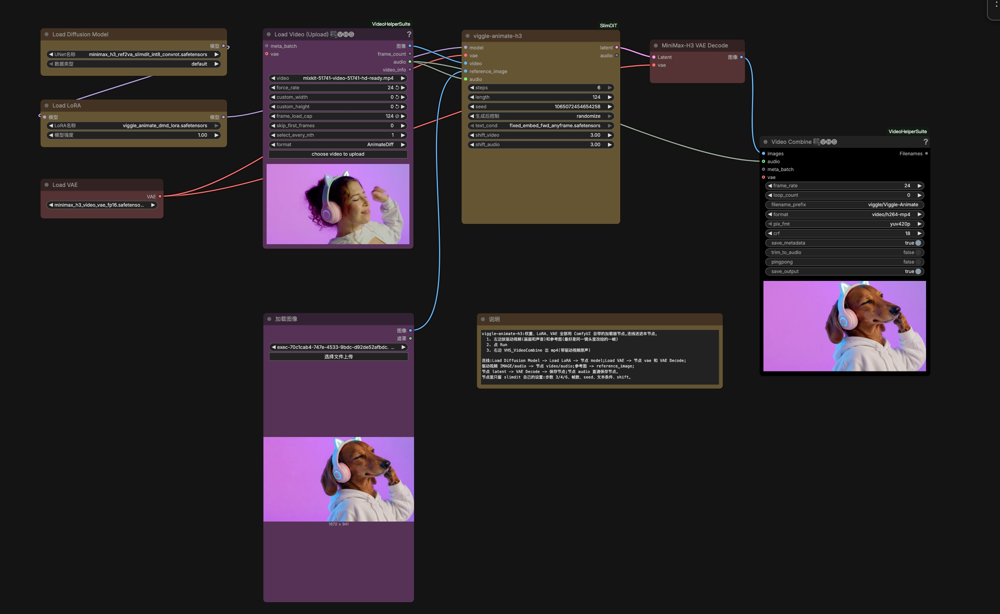

# viggle-animate-workflow

Viggle-Animate in one ComfyUI node, on a quantized checkpoint, with automatic attention routing.
Give it a driving clip and one still, and the character in the still does the clip.

## See it first

| input: driving clip | input: reference still | output: the render |
|---|---|---|
|  |  |  |

The full files are in [`examples/dog-singer/`](examples/dog-singer): the driving clip, the still and
the result as an mp4. Settings: 6 steps, 124 frames, flow shift 3/3, seed 833969396491604.

And this is the whole graph — weights, inputs, the node, decode and save:



## Credits

Built following the documentation of the **Viggle Animate** team —
[huggingface.co/Viggle/Viggle-Animate](https://huggingface.co/Viggle/Viggle-Animate).

Their docs are what we followed for the method: how to quantize and prune the model, the
conditioning order (driving footage first, the still nested on the clip's short edge), the rule
that a reference should be a repainted frame of the same shot, and the sampling settings. Thanks
to the Viggle Animate team.

For the ComfyUI side we used the community node pack
[ComfyUI-Viggle-Animate-H3](https://github.com/Saganaki22/ComfyUI-Viggle-Animate-H3), which is not
an official Viggle release — thanks to its author too.

The base model is [MiniMax-H3](https://huggingface.co/MiniMaxAI/MiniMax-H3) (MiniMax H3 Community
License); this checkpoint is the quantized Viggle-Animate, which is itself a finetune of MiniMax-H3.
It runs on [ComfyUI](https://github.com/comfyanonymous/ComfyUI) with
[Video Helper Suite](https://github.com/Kosinkadink/ComfyUI-VideoHelperSuite) and the `comfy_kitchen`
Sol-Attn kernels.

What is ours: the conversion code in `slimdit/`, the attention router, the one-node wrapper and the
packaging in this repository.

## What is in the repository

| Item | What it is |
|---|---|
| `minimax_h3_ref2va_slimdit_int8_convrot.safetensors` | the quantized checkpoint, 19.6 GiB; loads with the normal `Load Diffusion Model` node |
| `comfyui/ComfyUI-SlimDiT/` | the ComfyUI node pack: `viggle-animate-h3` and the attention router |
| `comfyui/workflows/viggle-animate-workflow.json` | the workflow from the screenshot, example already wired in |
| `slimdit/`, `tools/`, `tests/` | the conversion code, the tools we used to check it, and the tests |
| `examples/dog-singer/` | the driving clip, the still and the render shown above |

## Attention routing

Attention is the slowest part of a render. Which kernel is fastest depends on how long the clip is,
so the node picks one for every call instead of hard-coding a single choice:

* while the clip is short and free memory is enough for the extra copies, it uses **`sol_attn`** —
  at six steps that is **33.2 s instead of 38.3 s** at 124 frames, and **103.0 s instead of 116.4 s**
  at 243 frames (RTX 5090, 32 GiB);
* when the clip is longer, it uses the **normal dense attention** — it needs no extra memory, and on
  a 372-frame clip dense finished in **26.1 GiB and looked clean**, while the in-place quantized
  kernel used **31.8 GiB and showed ghosting** from around frame 124.

Short clips get the fast path and long clips get the safe one, without any switches. Only
MiniMax-H3's attention is touched, so other models in the same ComfyUI keep working normally.

## The example in detail

| | |
|---|---|
| driving clip | `mixkit-51741-video-51741-hd-ready.mp4`, 1280x720, 241 frames (~10 s) |
| reference still | a dachshund in a white hoodie with cat-ear headphones, pose and light matched to the clip, 1672x941 |
| settings | 6 steps, 124 frames, flow shift 3/3, seed 833969396491604 |
| result | `examples/dog-singer/result.mp4` |

The reference still is the trick. Match its pose, framing and lighting to the driving shot and the
result stays on-model for the whole 5.2 seconds.

## Install

```sh
git clone https://huggingface.co/xuexuexue1994/viggle-animate-workflow
cp -r viggle-animate-workflow/comfyui/ComfyUI-SlimDiT ComfyUI/custom_nodes/
cp -r viggle-animate-workflow/slimdit ComfyUI/custom_nodes/ComfyUI-SlimDiT/slimdit
cp viggle-animate-workflow/minimax_h3_ref2va_slimdit_int8_convrot.safetensors ComfyUI/models/diffusion_models/
```

Two things that tripped us up: the node pack needs the `slimdit` folder copied *inside*
`custom_nodes/ComfyUI-SlimDiT/`, and if you use `extra_model_paths.yaml` you have to list the model
folder there or ComfyUI will not see the checkpoint.

You will also need the MiniMax-H3 video VAE, the Viggle-Animate DMD LoRA and the frozen text
conditioning file — all from the upstream projects linked above.

## Licence

* **Weights**: MiniMax H3 Community License, inherited from the base model, following Viggle-Animate.
* **Code**: Apache-2.0.
